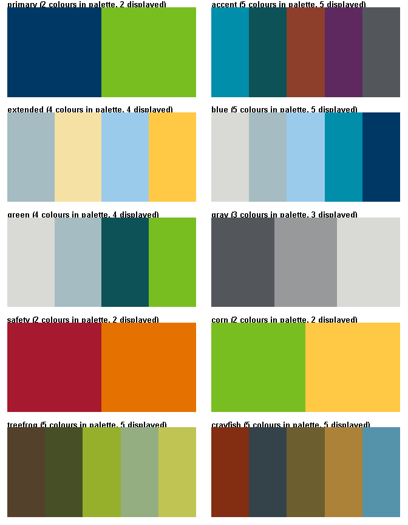
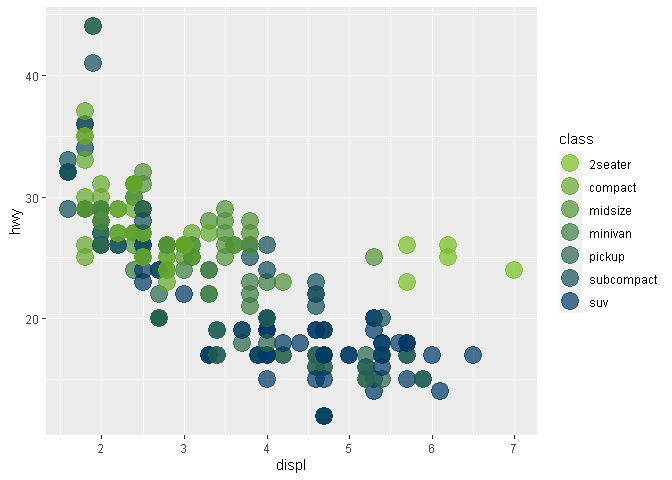
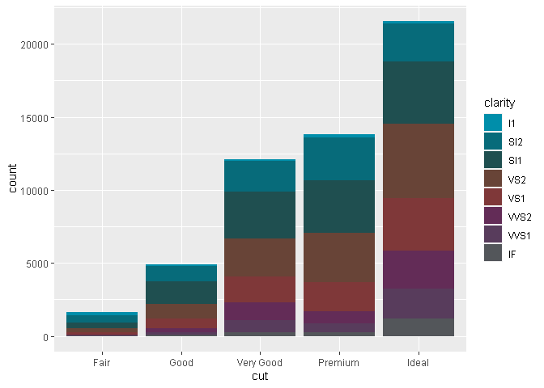
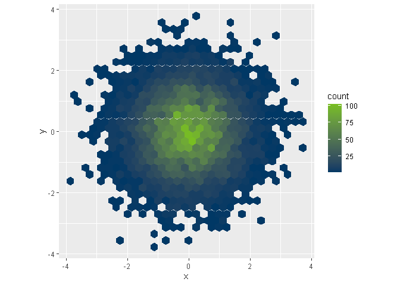
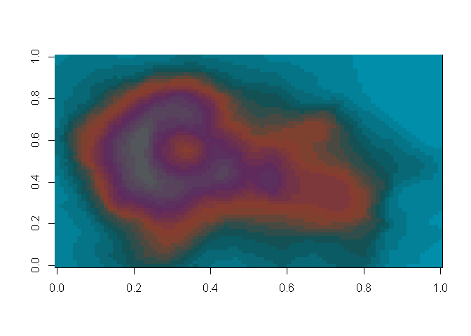

# Minnesota Color Palettes

The goal of `mncolors` is to paint your data with the colors available
in the [MN state brand style
guide](https://mn.gov/portal/brand/style-guide/colors/), as well as a
few color palettes inspired by local landscapes. Use the palettes with
`ggplot2` or `plot` to give your charts some MN style.

## Install

To install `mncolors` from github:

``` r
# First install the 'devtools' package
library(devtools)

remotes::install_github("MPCA-data/mncolors")
```

## The Palettes

``` r
pal_names <- names(mn_palettes)


par(mfrow=c(length(mn_palettes)/2, 2), lheight = 2, mar=rep(1, 4), adj = 0)

for (i in 1:length(mn_palettes)){
    viz_palette(mn_palettes[[i]], pal_names[i])
}
```

<!-- -->

## Examples

In a ggplot use the MN palettes with the `scale_fill_mn()` and
`scale_color_mn()` functions.

``` r
library(mncolors)
library(ggplot2)

# Primary
ggplot(data = mpg) +   
   geom_point(aes(x = displ, y = hwy, color = class), size = 6, alpha = 0.7) +
   scale_color_mn(palette = "primary", reverse = TRUE)
```

<!-- -->

``` r
# Extended
ggplot(data = mpg) +   
   geom_point(aes(x = displ, y = hwy, color = class), size = 6, alpha = 0.7) +
   scale_color_mn(palette = "extended")
```

<!-- -->

``` r
# Accent
ggplot(diamonds) + 
  geom_bar(aes(x = cut, fill = clarity)) +
  scale_fill_mn(palette = "accent")
```

<!-- -->

Alternatively, use`mncolors()` to feed MN colors to the default ggplot
functions.

``` r
library(ggplot2)
library(hexbin)

# Heat map
dat <- data.frame(x = rnorm(10000), y = rnorm(10000))

ggplot(dat, aes(x = x, y = y)) +
    geom_hex() + 
    coord_fixed() +
    scale_fill_gradientn(colors = mncolors(120, palette = "primary"))
```

<!-- -->

## Lots of colors\!

Enter any number you want to `mncolors()` to return a bucket of colors.

``` r
mncolors(10, "blue")
```

    ##  [1] "#D9D9D6FF" "#B0BEB9FF" "#A4BABDFF" "#A7C4D4FF" "#A5CCE8FF" "#89C4E5FF"
    ##  [7] "#4EAAC8FF" "#0084A0FF" "#005D7DFF" "#003865FF"

<!-- -->

``` r
mncolors(100, "green")
```

<!-- -->

In this example we use the `accent` palette directly via the
`colorRampPalette()` function for base plot folks.

``` r
## basic example code
pal <- colorRampPalette(mn_palettes[["accent"]])

image(volcano, col = pal(20))
```

<!-- -->
