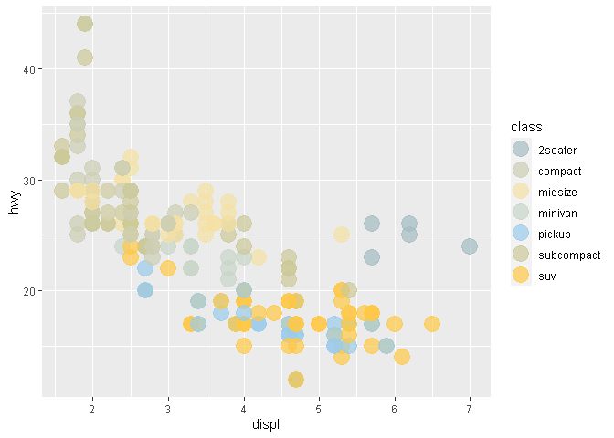
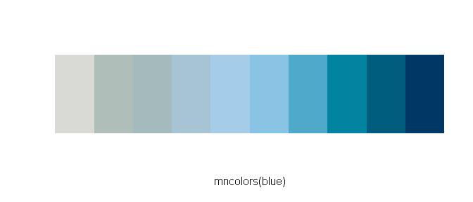
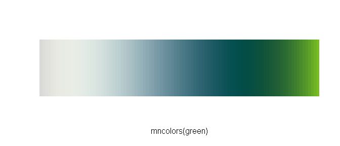

# MN Color Palettes

Use the `mncolors` package to paint your data with colors from the [MN state brand style
guide](https://mn.gov/portal/brand/style-guide/colors/), and a
few color palettes inspired by local landscapes and animals, such as tree frogs and crayfish. 

Use the palettes with `ggplot2` or `plot` to give your charts some MN style.

## Install

To install `mncolors`:

``` r
# First install the 'remotes' package
install.packages("remotes")

library(remotes)

# Now you can install mncolors from github
remotes::install_github("MPCA-data/mncolors")

```

## The Palettes

There are currently 10: primary, corn, accent, extended, blue, green,
gray, safety, treefrog, caryfish, and *trout (coming soon…)*.

<!-- -->

<br>

**More specifically:**

``` r
mn_palettes
```

    ## $primary
    ##   MN Blue  MN Green 
    ## "#003865" "#78BE21" 
    ## 
    ## $accent
    ## [1] "#008EAA" "#0D5257" "#8D3F2B" "#5D295F" "#53565A"
    ## 
    ## $extended
    ## [1] "#A4BCC2" "#F5E1A4" "#9BCBEB" "#FFC845"
    ## 
    ## $blue
    ## [1] "#D9D9D6" "#A4BCC2" "#9BCBEB" "#008EAA" "#003865"
    ## 
    ## $green
    ## [1] "#D9D9D6" "#A4BCC2" "#0D5257" "#78BE21"
    ## 
    ## $gray
    ## [1] "#53565A" "#97999B" "#D9D9D6"
    ## 
    ## $safety
    ## [1] "#A6192E" "#E57200"
    ## 
    ## $corn
    ## [1] "#78BE21" "#FFC845"
    ## 
    ## $treefrog
    ## [1] "#53412B" "#474F27" "#96B02C" "#94AD81" "#BFC453"
    ## 
    ## $crayfish
    ## [1] "#832D12" "#34424A" "#6C5E2E" "#AB8237" "#5493AA"

## Examples

In a ggplot use the MN palettes with the `scale_fill_mn()` and
`scale_color_mn()` functions.

``` r
library(mncolors)
library(ggplot2)

# Primary
ggplot(data = mpg) +   
   geom_point(aes(x = displ, y = hwy, color = class), size = 6, alpha = 0.7) +
   scale_color_mn(palette = "primary", reverse = TRUE)
```

<!-- -->

``` r
# Extended
ggplot(data = mpg) +   
   geom_point(aes(x = displ, y = hwy, color = class), size = 6, alpha = 0.7) +
   scale_color_mn(palette = "extended")
```

<!-- -->

``` r
# Accent
ggplot(diamonds) + 
  geom_bar(aes(x = cut, fill = clarity)) +
  scale_fill_mn(palette = "accent")
```

<!-- -->

``` r
# Crayfish
ggplot(diamonds) + 
  geom_col(aes(y = mean(price), x = cut, fill = cut)) +
  scale_fill_mn(palette = "crayfish")
```

<!-- -->

Alternatively, use`mncolors()` to feed MN colors to the default ggplot
functions.

``` r
library(ggplot2)
library(hexbin)

# Heat map
dat <- data.frame(x = rnorm(10000), y = rnorm(10000))

ggplot(dat, aes(x = x, y = y)) +
    geom_hex() + 
    coord_fixed() +
    scale_fill_gradientn(colors = mncolors(120, palette = "primary"))
```

<!-- -->

## Lots of colors\!

Enter any number you want to `mncolors()` to return a bucket of colors.

``` r
mncolors(10, "blue")
```

    ##  [1] "#D9D9D6FF" "#B0BEB9FF" "#A4BABDFF" "#A7C4D4FF" "#A5CCE8FF" "#89C4E5FF"
    ##  [7] "#4EAAC8FF" "#0084A0FF" "#005D7DFF" "#003865FF"

<!-- -->

``` r
mncolors(100, "green")
```

<!-- -->

In this example we use the `accent` palette directly via the
`colorRampPalette()` function for base plot folks.

``` r
## basic example code
pal <- colorRampPalette(mn_palettes[["accent"]])

image(volcano, col = pal(20))
```

<!-- -->

